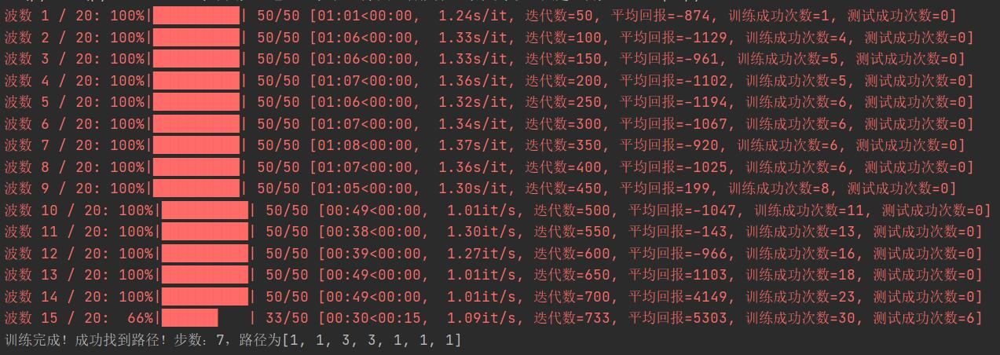

该项目使用DQN架构训练智能体完成走迷宫任务

# 项目效果
- 训练画面，绿色是终点

- 某次成功收敛的结果

# 文件结构
- molab：使用已有库完成走迷宫任务的方案，需要通过获取全图视野来生成完美轨迹训练，但是效果也最好，详见文件夹内的README.md。
- record：一些记录。
- old_programme：旧的方案
     - deep Qlearning.py：一代方案，不获取全图视野纯靠探索，没有可视化UI早期demo，有迷宫、DQN、智能体、训练流程等全部内容。
     - DQN.py + main.py：二代方案，在一代基础上多了基于PyQT5的UI，状态state是整个二维地图，使用Q net用卷积网络，效果一般，大概率不收敛。
- DQN.py + main.py：三代方案，将状态state改回坐标xy，使用Q net用全连接网络，优化了奖励规则，调了很久参数，相对容易收敛，但是仍有一定可能不收敛。
- utils.py：一些工具函数。
- map.txt：地图文件，1：墙，0：路，2：起点，终点在py文件内设置。
- DQN.pth + DQN-target.pth：三代方案下保存的模型参数（只有对应地图和终点设置能用）。

# 目前项目的思考
- DQN在不获取全局视野作为训练样本的情况下，纯靠从起点开始移动探索，很容易不收敛。
- 在前期ε很大的情况下如果能多碰巧到达终点累积成功样本，会增加收敛的可能性，反之前期很少成功则，大概率不收敛。这也意味着在终点比较远或者地图大且复杂时很难收敛，或者至少时间成本会很高。
- 对于奖励规则，应该尽可能引导智能体不去陷入撞墙、反复横跳等局部最优，所以应该对这些情况给予惩罚，当前本项目用了寻访计数来存储已经到过的位置，用来奖励新的探索并惩罚到旧的位置，效果还是有提升的。而奖励规则设计本身还是挺靠想象和主观感受的。
- 经验回放池使用队列存储，而大部分的样本都是不成功的，所以经验回访池里面的样本正样本太少，抽取batch时不容易抽到，这也是收敛速度低迷的原因，所以后续还可以改进机制，尽可能多存成功的样本。
- 所以是否能获取全局视野，在训练开始时就能获取很好的样本至关重要，这可能与实际应用场景的要求有关，能获取应该尽量获取。